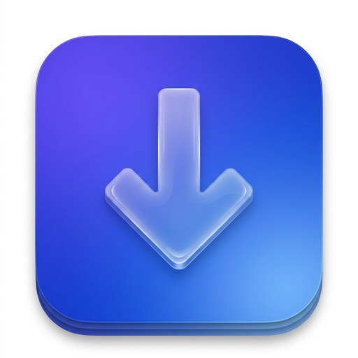
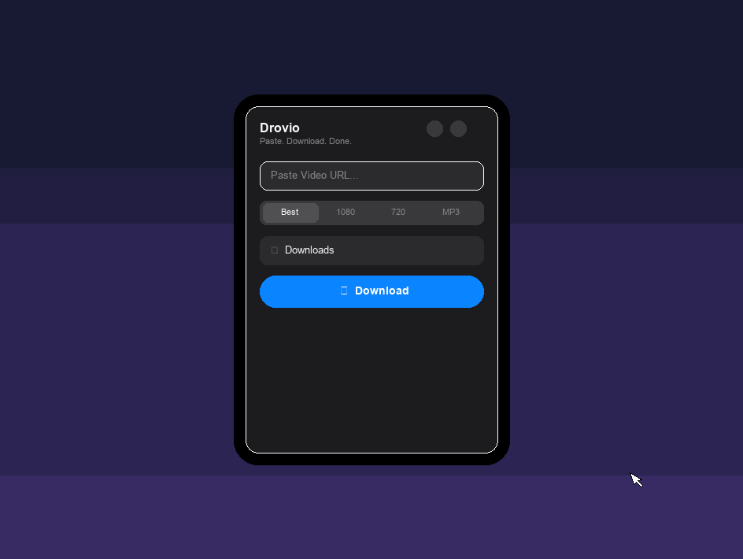
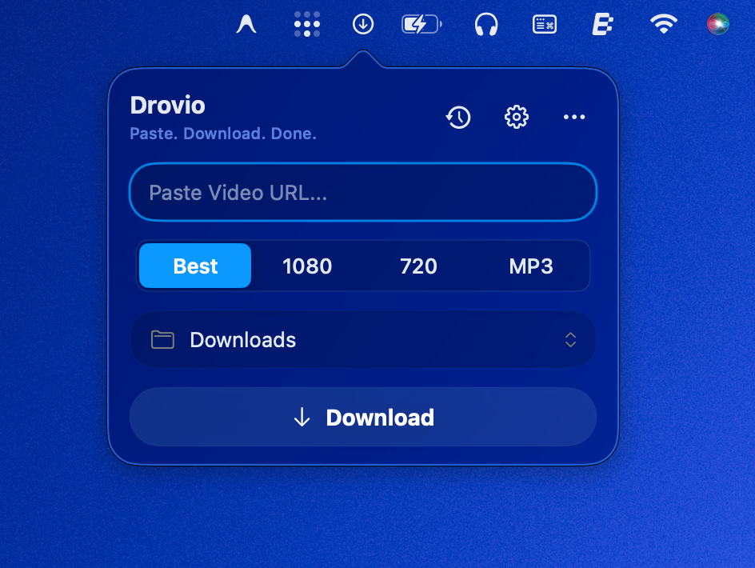

<p align="center">
  
</p>

<h1 align="center">Drovio</h1>

<p align="center">
  
  <br><br>
  
</p>

<p align="center">
  <b>A premium, native macOS menu bar downloader. Copy link to download from YouTube, Instagram, Spotify, and Apple Music instantly.</b>
</p>

<p align="center">
  <a href="https://github.com/ombichave999/Drovio/releases/latest">
    
  </a>
  
  
  
</p>

---

**Drovio** is a lightweight, blazing-fast, and completely private downloader for macOS. Built purely with Swift 6 and SwiftUI, it sits quietly in your menu bar without cluttering your dock, allowing you to instantly download media from **YouTube**, **Instagram**, **Spotify**, and **Apple Music** simply by copying a link.

## Features

- [x] **Native SwiftUI Interface**: Beautiful, responsive layout with frosted-glass effects.
- [x] **Smart Clipboard Detection**: Instantly detects video/image URLs on copy and prompts you to download.
- [x] **YouTube Downloader**: Download YouTube videos and Shorts in high quality.
- [x] **Instagram Reels & Posts**: Download reels, single photos, and multi-image carousels/slideshows natively.
- [x] **Music Extraction**: Support for downloading audio-only from Spotify and Apple Music links.
- [x] **Multi-format Support**: Download in highest quality, 1080p, 720p, or extract MP3/M4A audio.
- [x] **Live Download Queue**: Manage up to 3 concurrent downloads with live progress, speed tracking, and ETAs.
- [x] **Pause / Resume / Cancel**: Full download lifecycle management.
- [x] **Native macOS Notifications**: Get notified when downloads complete and open files directly in Finder.
- [x] **Local Download History**: Keeps track of recent downloads with thumbnails.
- [x] **Launch at Login**: Easily toggle start-on-boot from Settings.
- [x] **Automatic Dependencies**: Silently downloads and updates its helper binaries (`yt-dlp` and `ffmpeg`) internally.

---

# Installation

Drovio can be installed either from the precompiled release or by building from source.

---

## Method 1 — Download the Precompiled App (Recommended)

1. Download the latest DMG from GitHub Releases.
2. Open the DMG.
3. Drag Drovio.app into the Applications folder.
4. Launch Drovio.

> [!NOTE]
> If macOS blocks the application because it is from an unidentified developer, right-click the app, choose Open, then click Open again.

---

## Method 2 — Install Using Terminal

Advanced users can install directly from Terminal.

```bash
curl -L -O https://github.com/ombichave999/Drovio/releases/latest/download/Drovio.dmg
hdiutil attach Drovio.dmg
cp -R /Volumes/Drovio/Drovio.app /Applications/
hdiutil detach /Volumes/Drovio
open /Applications/Drovio.app
```

If Gatekeeper prevents the application from launching, you may need to clear the macOS download lock. This is standard behavior for independent, open-source Mac apps that aren't signed with a paid Apple Developer certificate ($99/year). Because Drovio is fully open-source, its code is public and auditable for anyone to inspect:

```bash
sudo xattr -rd com.apple.quarantine /Applications/Drovio.app
```

Then launch again.

---

## Method 3 — Build from Source

### Requirements

* Xcode 16+
* macOS 15+
* Git

### Steps

1. Clone this repository:
```bash
git clone https://github.com/ombichave999/Drovio.git
```
2. Open Drovio.xcodeproj.
3. Select the Drovio scheme.
4. Press Command + R.

Ad-hoc signing is already configured so an Apple Developer account is not required for local builds.

---

## Troubleshooting

<details>
<summary><b>"Drovio is damaged and can't be opened"</b></summary>

This warning occurs because the app is not signed with a paid Apple Developer certificate. This is standard behavior for free, open-source, and independent software. Drovio is completely safe, does not track you, and its source code is fully public and auditable here on GitHub. 

To bypass this warning and unlock the app, open your Terminal and run this command:

```bash
sudo xattr -rd com.apple.quarantine /Applications/Drovio.app
```
</details>

<details>
<summary><b>App won't launch</b></summary>

Delete the old version of the app from your Applications folder, reinstall the latest build, and verify that appropriate read/write permissions are granted.
</details>

<details>
<summary><b>Build errors</b></summary>

Ensure you are using the latest stable release of Xcode and clean the build folder by pressing Command + Shift + K before attempting to build again.
</details>

---

## Updating

Users can simply replace the app with the latest release from GitHub.

---

## Installation via Homebrew Cask

You can install Drovio using Homebrew by targeting the cask:

```bash
brew install --cask Casks/drovio.rb
```

---

## Roadmap

- [ ] **YouTube Playlist Support**: Download complete video playlists with one click.
- [ ] **Batch Downloads**: Paste multiple URLs at once.
- [ ] **Browser Extensions**: Quick-send links to Drovio from Chrome, Safari, and Firefox.
- [ ] **Custom Output Folders**: Custom folder rules based on download source platform.

---

## Architecture (MVVM)

```text
Drovio/
├── App/            DrovioApp, AppDelegate, AppContainer (DI composition root)
├── Models/         DownloadTask, VideoInfo, VideoQuality, HistoryItem, DownloadError
├── ViewModels/     DownloadManager (queue, scheduling, lifecycle)
├── Views/          MainView, HistoryView, SettingsView, Components/
├── Services/       DownloadEngine (actor), Toolbox (actor, tool install/update),
│                   ClipboardMonitor, NotificationManager, SettingsManager, HistoryManager
└── Utilities/      URLValidator, FilenameSanitizer, ProcessRunner, Log
```

- `DownloadEngine` is a Swift actor that manages yt-dlp processes and parses live progress data.
- `Toolbox` automates binary bootstrap checks and updates.
- Stderr/stderr streams are mapped to user-friendly errors (private, deleted, age-restricted, network, etc.).

### Tech Stack Details & GitHub Language Stats
* **Language Detection:** GitHub reports this repository as containing ~50% Objective-C. This is purely because the public headers of the bundled **Sparkle.framework** (located in `Sparkle-Tools/`) are written in Objective-C. The core application logic and codebase are **100% Swift 6 / SwiftUI**.
* **Notarization & Gatekeeper:** Because Drovio is self-built and distributed outside the Mac App Store, macOS Gatekeeper may show a warning that the app is "damaged" or from an "unidentified developer." Hardened notarization requires an Apple Developer Account subscription ($99/yr) and signing with a Developer ID Application certificate. If you do not have a paid account, you can build from source or remove the quarantine attribute as described in Troubleshooting.

---

## Legal & Disclaimer

**Drovio** is an open-source tool created for educational and personal use. By using this software, you agree that:
- You are solely and fully responsible for complying with the terms of service, policies, and copyright restrictions of any third-party platforms (such as YouTube, Instagram, Spotify, Apple Music, etc.) from which you download content.
- You will not download copyrighted material without explicit permission from the original owner or appropriate legal authorization under your local copyright laws.
- The developers of Drovio assume no responsibility or liability for any copyright infringement or misuse of this tool. Use of the software is entirely at your own risk.
